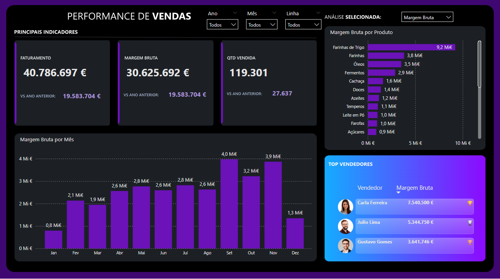

# Análise de Desempenho de Vendas e Margem Bruta na PBI_DIST

**Live Demo:** https://app.powerbi.com/view?r=eyJrIjoiNmE0NWIxYmUtNDYzNy00ODNlLWJlMGQtYzNmYmMyMTUxYzdhIiwidCI6ImNjZWJlNmYwLTMwNTAtNDJiZC1hYjFkLWRmMTFhOTM5ZjNhYSIsImMiOjl9
## Sobre
Este dashboard apresenta:
- Indicadores de vendas (volume e valor)  
- Análise de margem bruta por produto e categoria  
- Evolução temporal de receita e margem  
- Comparativo entre canais de vendas

## Tecnologias
- Power BI Desktop (M, DAX)
- Fonte de dados: Arquivos CSV
- Deploy no Power BI Service

## Como rodar localmente
1. Clone este repositório  
2. Abra `Desempenho-Vendas-Pbidist.pbit` no Power BI Desktop  
3. Configure as credenciais na janela de **Transformar Dados**  
4. Clique em **Refresh**

> **Nota:** o arquivo `.pbit` será adicionado assim que o problema de corrupção no modelo for resolvido.
