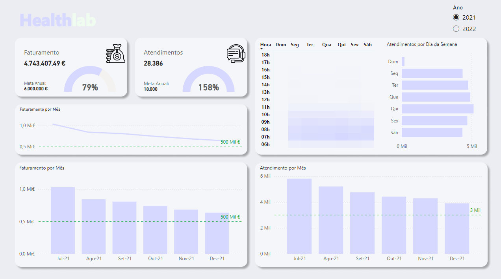

# Healthlab

**Live Demo:** https://app.powerbi.com/view?r=eyJrIjoiY2E5OTc2OTctMTBiNC00MzlmLTgxMmMtMzg2NmE1MTIyN2Y4IiwidCI6ImNjZWJlNmYwLTMwNTAtNDJiZC1hYjFkLWRmMTFhOTM5ZjNhYSIsImMiOjl9

## Sobre
Este dashboard apresenta:
- Principais métricas de desempenho clínico
- Análise de diagnósticos mais comuns
- Tendências de utilização de serviços
- Indicadores de satisfação de pacientes

## Tecnologias
- Power BI Desktop (M, DAX)
- Fonte de dados: Arquivos CSV
- Deploy no Power BI Service

## Como rodar localmente
1. Clone este repositório  
2. Abra `Healthlab.pbit` no Power BI Desktop  
3. Configure as credenciais na janela de **Transformar Dados**  
4. Clique em **Refresh**

> **Nota:** o arquivo `.pbit` será adicionado assim que o problema de corrupção no modelo for resolvido.
