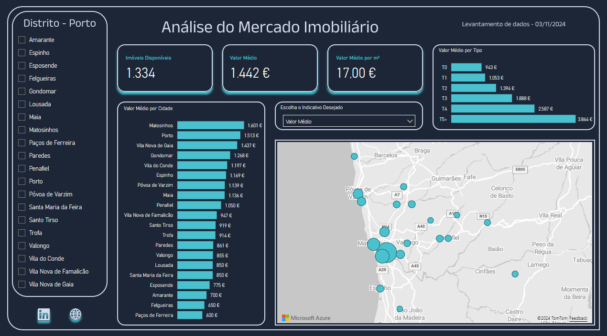

# Análise do Mercado Imobiliário – Distrito do Porto, Portugal

**Live Demo:** https://app.powerbi.com/view?r=eyJrIjoiNmNiMTYzNzAtNjUwMS00MjYyLTkwOTctNWMwYjYyY2IzZWE4IiwidCI6ImNjZWJlNmYwLTMwNTAtNDJiZC1hYjFkLWRmMTFhOTM5ZjNhYSIsImMiOjl9

## Sobre
Este dashboard apresenta:
- Quantidade de imóveis disponíveis
- Preço médio por freguesia  
- Preços médio por m2
- Preços médio por tipo de imóvel 

## Tecnologias
- Power BI Desktop (M, DAX) / Pandas
- Fonte de dados: API Imobiliária / qrquivos CSV
- Deploy no Power BI Service

## Como rodar localmente
1. Clone este repositório  
2. Abra `Analise-Mercado-Imobiliario-Porto.pbit` no Power BI Desktop  
3. Configure as credenciais na janela de **Transformar Dados**  
4. Clique em **Refresh**

> **Nota:** o arquivo `.pbit` será adicionado assim que o problema de corrupção no modelo for resolvido.
