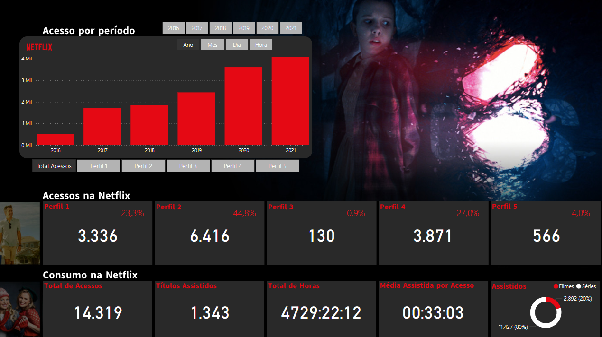

# Dashboards Netflix Analytics

**Live Demo:** https://app.powerbi.com/view?r=eyJrIjoiMTRkNTkyNzUtYjAwMS00NjQ0LWEyY2ItNGFlZTNjYTI2MzZhIiwidCI6ImNjZWJlNmYwLTMwNTAtNDJiZC1hYjFkLWRmMTFhOTM5ZjNhYSIsImMiOjl9

## Sobre
Este dashboard apresenta:
- Acesso por período
- Consumo por usuário
- Tendências de séries e filmes
- Horas de consumo
- Média de horas por acesso

## Tecnologias
- Power BI Desktop (M, DAX)
- Deploy no Power BI Service

## Como rodar localmente
1. Clone este repositório  
2. Abra `NetflixAnalytics.pbit` no Power BI Desktop  
3. Configure as credenciais na janela de **Transformar Dados**  
4. Clique em **Refresh**

> **Nota:** o arquivo `.pbit` será adicionado assim que o problema de corrupção no modelo for resolvido.
