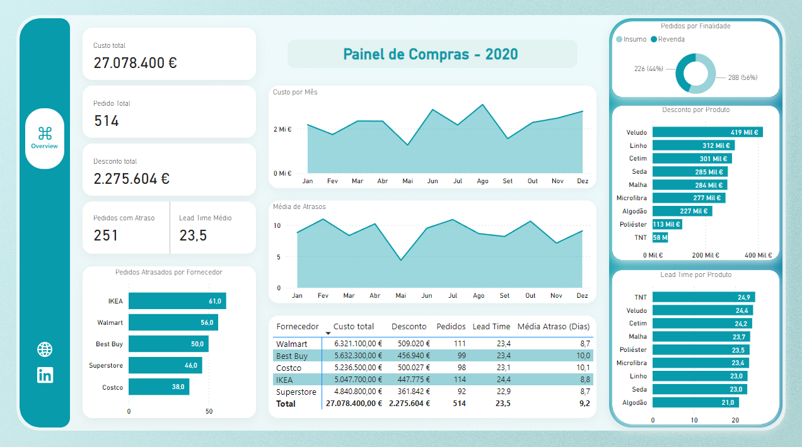

# Painel de Compras - 2020

**Live Demo:** https://app.powerbi.com/view?r=eyJrIjoiNmM1MjcwZmItMGViMC00ZmUwLWE5MTgtYjkyNDA2ZTE2MmZiIiwidCI6ImNjZWJlNmYwLTMwNTAtNDJiZC1hYjFkLWRmMTFhOTM5ZjNhYSIsImMiOjl9

## Sobre
Este dashboard apresenta:
- Evolução mensal de gastos
- Distribuição de compras por categoria de produtos
- Ranking de fornecedores por volume de compras
- Indicadores de lead time e performance de entregas 

## Tecnologias
- Power BI Desktop (M, DAX)
- Fonte de dados: Arquivos CSV
- Deploy no Power BI Service

## Como rodar localmente
1. Clone este repositório  
2. Abra `Painel-Compras-2020.pbit` no Power BI Desktop  
3. Configure as credenciais na janela de **Transformar Dados**  
4. Clique em **Refresh**

> **Nota:** o arquivo `.pbit` será adicionado assim que o problema de corrupção no modelo for resolvido.
