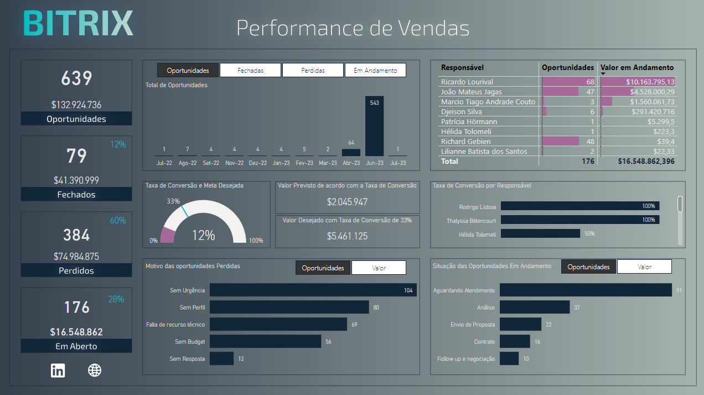

# Performance de Vendas — Bitrix

**Live Demo:** https://app.powerbi.com/view?r=eyJrIjoiZWY5MjVmNDItZDUyNS00Y2Q0LWI2MjgtNjUxOWQ5MDU4ZDNmIiwidCI6ImNjZWJlNmYwLTMwNTAtNDJiZC1hYjFkLWRmMTFhOTM5ZjNhYSIsImMiOjl9

## Sobre
Este dashboard apresenta:
- KPIs chave de vendas (Faturamento, Número de Pedidos, Ticket Médio)  
- Gráficos de evolução diária, semanal e mensal  
- Metas vs. realizado por equipe e região  
- Análise de top produtos e clientes  

## Tecnologias
- Power BI Desktop (M, DAX)
- Fonte de dados: Arquivos CSV
- Deploy no Power BI Service

## Como rodar localmente
1. Clone este repositório  
2. Abra `Bitrix2024.pbit` no Power BI Desktop  
3. Configure as credenciais na janela de **Transformar Dados**  
4. Clique em **Refresh**

> **Nota:** o arquivo `.pbit` será adicionado assim que o problema de corrupção no modelo for resolvido.
